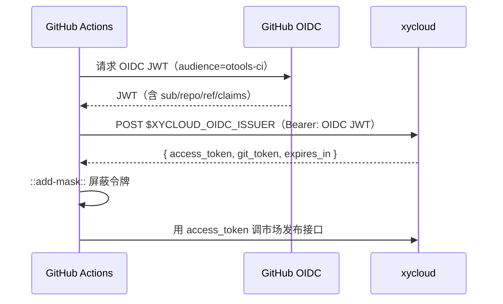

# 插件发布 CI

`.github/workflows/release-plugin.yml` 参照 otools-publish 的 `build-otools-plugin.yml` 实现，
针对「独立插件仓库」做了裁剪：插件源码就在本仓库，不需要 clone OTools 再构建。

## 触发方式

| 触发 | 说明 |
| --- | --- |
| 手动（workflow_dispatch） | 可填版本号、是否同步市场、是否 dry-run |
| 推送 tag `v*` | 自动发布，`dry_run` 视为 false |

## 流水线

1. **build**：安装依赖 → `pnpm typecheck` → `pnpm build` → `node scripts/pack-plugin.mjs` → 上传 `.oplg`
2. **workload-token**：用 GitHub OIDC 身份向 xycloud 换短期访问令牌（仅在需要同步市场时运行）
3. **publish**：创建 GitHub Release 并附带 `.oplg`；随后用短期令牌把插件元信息提交到插件市场

## 打包格式

`scripts/pack-plugin.mjs` 产出与 `otools/scripts/plugin_pack.py` 一致的 `.oplg`——
本质是 ZIP，内含 `plugin.json`、`logo.svg` 与 `dist/`（若存在 `lib/` 也会带上）。
脚本零依赖（用 `node:zlib` 手写 ZIP 结构），并会校验 `manifest.entry` 指向的文件确实在包内。

```bash
node scripts/pack-plugin.mjs --out dist-pack --version 0.1.0
```

## 认证：OIDC 工作负载身份联合

仓库中**不保存任何长期凭证**。CI 使用 GitHub Actions 内置的 OIDC 身份（`id-token: write` 权限）
拿到一枚 JWT，再拿它向 xycloud 换一个**分钟级有效的访问令牌**：



配置项（仓库 Variables）：

| Variable | 用途 |
| --- | --- |
| `XYCLOUD_OIDC_ISSUER` | xycloud 的令牌交换端点，例如 `https://api.lingyun.net/api/v1/user_pat/workload/token` |
| `XYCLOUD_OIDC_AUDIENCE` | OIDC 受众，默认 `otools-ci` |
| `OTOOLS_MARKET_API` | 插件市场发布接口，默认 `https://otools-api.lingyun.net/api/v1/otools/plugin/publish` |
| `OTOOLS_WEBSITE_BASE_URL` | 官网基址，用于拼插件主页地址 |

未配置 `XYCLOUD_OIDC_ISSUER` 时会回退到旧的 `secrets.OTOOLS_MARKET_TOKEN`（打印弃用告警），
两者都没有则跳过市场同步，只产出 Release。

## xycloud 侧需要实现的契约

### 1. `POST /api/v1/user_pat/workload/token`（免登录）

请求头：

- `Authorization: Bearer <GitHub OIDC JWT>`
- `X-Repository` / `X-Workflow` / `X-Run-Id`：用于审计

请求体：`{ "audience": "otools-ci", "scope": "otools:plugin:publish" }`

响应：

```json
{
  "access_token": "<短期 JWT，claims 含 sub/repository/aud/exp/scope>",
  "git_token": "<可选，用于推送官网仓库的短期凭证>",
  "expires_in": 900
}
```

服务端需校验：JWT 签名与 `iss=https://token.actions.githubusercontent.com`、
`aud`、`exp`，以及 `repository` 是否在白名单内。

### 2. 市场发布接口鉴权

`POST $OTOOLS_MARKET_API`，请求头 `Authorization: Bearer <access_token>`，
由 xycloud 校验 `scope` 是否包含 `otools:plugin:publish`。

### 3. 用户 PAT 模块（`app/_user/user_pat`）

用户 PAT 是**个人长期凭证**，用于本地开发与非 CI 场景，也能兑换短期令牌：

| 能力 | 说明 |
| --- | --- |
| 创建 | 指定名称、作用域、有效期（7/30/90/365 天或自定义），明文**只在创建时返回一次** |
| 销毁 | 立即失效，记录 `deleteTime` |
| 重置 | 原地作废旧明文并生成新明文，返回一次性明文 |
| 列表 | 只返回前缀掩码（`xy_pat_****abcd`）、作用域、过期时间、最近使用时间，不含明文 |
| 兑换 | 用 PAT 换取短期 access_token（与 OIDC 换取同一套 scope 模型） |

存储：明文只保存哈希（`hash('sha256', $plain)`）与前缀，
表结构建议 `xy_user_pat`：`gid / cloudAlias / id / uid / name / prefix / tokenHash /
scope / expiresAt / lastUsedAt / usedCount / status / deleteTime / createTime / updateTime`
（字段风格对齐 `install.json` 中 `tableRows` 的既有约定）。
